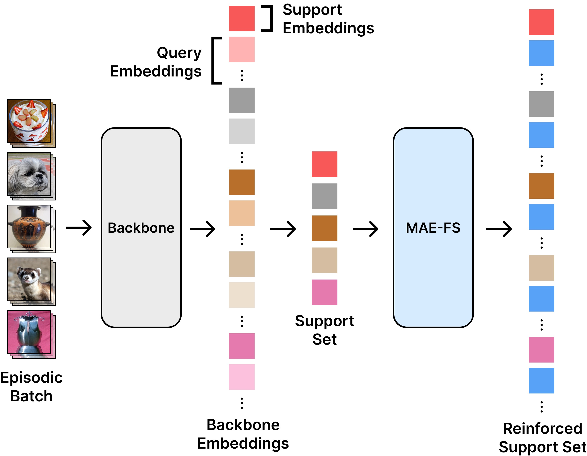

<h1 align="center">MAE-FS</h1>

Masked Autoencoders for Few-Shot Learning (MAE-FS) is a self-supervised, generative technique that reinforces few-shot classification performance for a frozen prototypical backbone model.



## Experiments

Test MAE-FS on a wide range of out-of-domain and in-domain datasets.

### Requirements

Install the requirements necessary for running MAE-FS. A virtual environment (or similar) is recommended.

```bash
pip install -r requirements.txt
```

### Datasets

Datasets used in this work can be obtained at the following links:

- [mini-imagenet](https://github.com/yaoyao-liu/mini-imagenet-tools)
- [BCCD WBC](https://www.kaggle.com/datasets/brikwerk/bccd-white-blood-cell)
- [HEp-2](https://www.kaggle.com/datasets/brikwerk/hep2-human-epithelial-cell-images)
- [IKEA-FS](https://www.kaggle.com/datasets/brikwerk/ikeafs)
- [CVPRL2ID Track 1 Small Scale](https://github.com/yunhuiguo/CVPR-2021-L2ID-Classification-Challenges#track-1-cross-domain-small-scale)

After downloading all datasets, you should extract/place each respective dataset's folder in the same directory.

### Pretrained Weights

You can download pretrained weights for MAE-FS from [HuggingFace](https://huggingface.co/brikwerk/MAE-FS/tree/main/weights)

To use the pretrained weights, create a `weights` folder at the root of this repo and place all pretrained weights in it.

### Running Experiments

Run the `test.sh` shell script and specify the number of shots to test and the path to the root data directory (where you placed the downloaded datasets earlier). A 5-shot example run is shown below with a data root of `~/Data`:

```bash
./test.sh 5 "~/Data"
```

### Custom Experiments

To run an experiment with custom hyperparameters and/or with specific datasets, the `fs_test.py` can be run directly with arguments applied.

To see a full list of available options, run the following command to see the help dialogue:

```
python3 fs_test.py --help
```

## Results

### In-Domain and Out-of-Domain Results

|                          | In-domain |       | Out-of-domain |       |       |       |         |       |
|--------------------------|-----------|-------|---------------|-------|-------|-------|---------|-------|
|                          | MIN       |       | BCCD          |       | HEp-2 |       | IKEA-FS |       |
|                          | 5w1s      | 5w5s  | 5w1s          | 5w5s  | 5w1s  | 5w5s  | 5w1s    | 5w5s  |
| MAE-FS (IN1K, ViT-Small) | 95.73     | 98.91 | 54.24         | 66.52 | 58.6  | 71.21 | 59.04   | 76.02 |
| MAE-FS (IN1K, ResNet-18) | 88.36     | 97.11 | 45.21         | 59.81 | 45.02 | 58.78 | 51.12   | 72.89 |
| MAE-FS (MIN, CONV4)      | 53.86     | 69.29 | 46.58         | 57.53 | 44.9  | 56.06 | 39.23   | 57.46 |

### CVPR L2ID

|                          | ChestX |       | ISIC  |       | EuroSAT |       | Plant Disease |       |
|--------------------------|--------|-------|-------|-------|---------|-------|---------------|-------|
|                          | 5w1s   | 5w5s  | 5w1s  | 5w5s  | 5w1s    | 5w5s  | 5w1s          | 5w5s  |
| MAE-FS (IN1K, ViT-Small) | 23.85  | 27.98 | 37.09 | 51.02 | 75.91   | 88.77 | 83.74         | 95.04 |
| MAE-FS (IN1K, ResNet-18) | 21.93  | 24.12 | 33.17 | 46.4  | 65.54   | 80.56 | 78.92         | 92.58 |
| MAE-FS (MIN, CONV4)      | 21.73  | 24.05 | 33.88 | 43.44 | 59.72   | 72.76 | 65.57         | 83.58 |